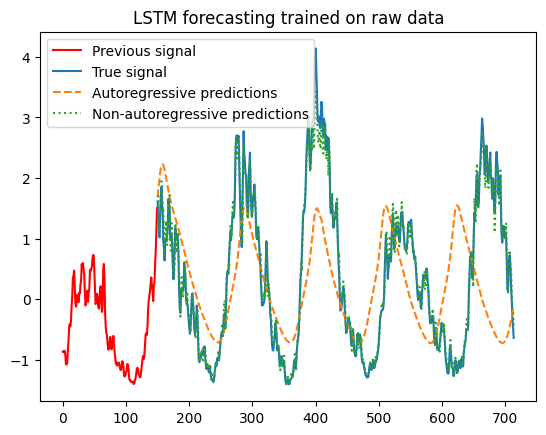
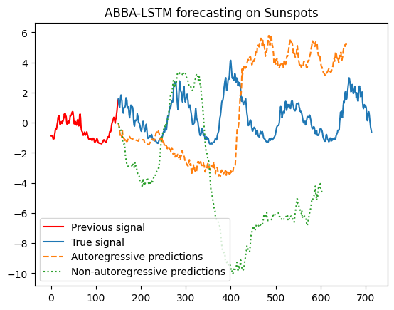

# abba-lstm
An implementation of ABBA symbolic representation of Time series and LSTM training on top of that.

The idea of ABBA is to represent a time series as a sequence of symbols. First, the time series is divided into linear segments. Then, a clustering algorithm is used to learn a set of symbols that represent the segments. Finally, the time series is represented as a sequence of symbols. This representation is used to train a LSTM model to forecast the time series.

We found that the original implementation of ABBA had an issue the train and test sets were not being split correctly. We fixed this issue and used the ABBA representation to train a LSTM model on the sunspot dataset. The results were not as good as the original paper. Training the LSTM model on the raw time series performed much better than the ABBA representation.




A full report of the project is available here: [report.pdf](./report.pdf).

References:

Elsworth, S., & Güttel, S. (2020). ABBA: Adaptive Brownian bridge-based symbolic aggregation of time series. Data Mining and Knowledge Discovery, 34(4), 1175-1200. [Link](https://arxiv.org/abs/2003.12469).

Elsworth, S., & Güttel, S. (2020). Time series forecasting using LSTM networks: A symbolic approach. arXiv preprint arXiv:2003.05672. [Link](https://arxiv.org/abs/2003.05672).


## Set up

The code was written in Python 3.11.4. Poetry was used to manage the dependencies. And a makefile was used to create shortcuts for the most common commands.

To install the project:

```bash
make install
```

## Usage

There are two notebooks:
- `toy_dataset.ipynb`: This notebook shows how to use the ABBA representation and how to train a LSTM model on top of it. It uses a toy dataset which is a simple sine wave.
- `main.ipynb`: This notebook evaluates the ABBA representation and the LSTM model the sunspot dataset.


